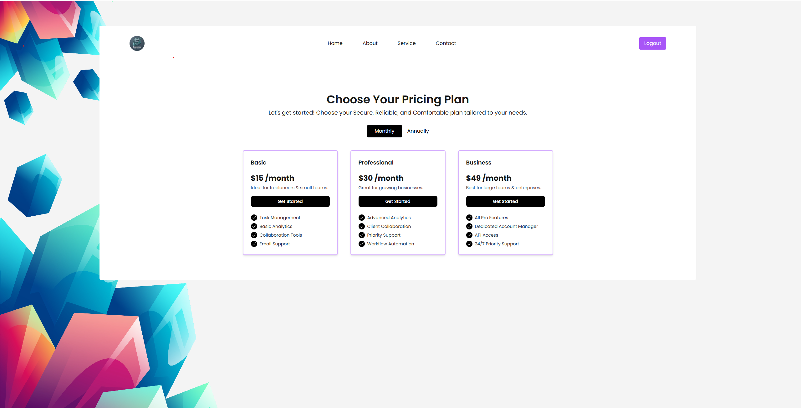

# Stripe Payment App

## Overview

The **Stripe Payment App** is a test project designed to demonstrate the integration of Stripe's payment API for various payment scenarios, including **one-time payments**, **subscriptions**, and **trial subscriptions**. It uses **Next.js** for the frontend, **Express** for the backend, and **MongoDB** for data storage. The app also uses **Docker** for containerization, making it easy to set up and deploy.

This project serves as an example for testing and development purposes, showcasing how to integrate Stripe’s API for handling payments and subscriptions.
### Project Directory Structure
Here’s an overview of the directory structure for the project:

        stripe-payment-app/
        ├── assets/                           
        │   └── images/
        │       └── home-page.png             
        ├── backend/                          
        │   ├── controllers/                  
        │   ├── models/                       
        │   ├── routes/                       
        │   ├── .env                          
        │   ├── app.js                        
        │   └── server.js                     
        ├── frontend/                         
        │   ├── components/                   
        │   ├── pages/                        
        │   ├── public/                       
        │   ├── .env.local                    
        │   └── next.config.js                
        ├── docker-compose.yml                
        ├── Dockerfile                        
        ├── README.md                         
        ├── package.json                      
        └── .gitignore
        
## Features

-   **One-Time Payment**: Process single payments using Stripe's API.
-   **Subscription Payments**: Implement subscription billing with recurring payments.
-   **Trial Subscriptions**: Allow users to start a trial period before being charged for a subscription.
-   **Dockerized**: The project is containerized using Docker for easy deployment and management.
-   **MongoDB Integration**: Store user and transaction data securely in MongoDB.
-   **Express Backend**: RESTful API built with Express to manage payments and subscriptions.
-   **Next.js Frontend**: React-based frontend for handling the user interface.

## Frontend Preview

Here is a preview of the homepage of the Stripe Payment App:



## Tech Stack

-   **Frontend**:
    -   Next.js (React)
    -   Stripe Elements (for securely handling payment details)
-   **Backend**:
    -   Express.js (Node.js framework for the API)
    -   Stripe Node.js SDK
-   **Database**:

    -   MongoDB (NoSQL database to store user and transaction data)

-   **Containerization**:
    -   Docker (for easy deployment)

## Prerequisites

-   Docker installed on your machine
-   Node.js and npm installed
-   Stripe account (sign up at [Stripe](https://stripe.com))

## Setup
-1. Setup Docker
    To build and start the Docker containers:
        ```docker-compose up --build```
    
    This will build and start the following containers:

    ```Frontend (Next.js): Available on http://localhost:3000
    Backend (Express API): Available on http://localhost:5000```
    
    MongoDB: Running in the background for data storage.
-2. Environment Variables
You will need to configure your environment variables. Create a .env file in the root directory and add the following variables:

# Stripe Secret Key
```STRIPE_SECRET_KEY=your_stripe_secret_key```

# MongoDB URI
MONGO_URI=mongodb://mongo:27017/stripe-payment-app

# Stripe Webhook Secret (if you are using webhooks)
STRIPE_WEBHOOK_SECRET=your_stripe_webhook_secret
Replace the values with your actual keys from Stripe.

-3. Start the Application
    Once the containers are up and running, you can access the application at the following URLs:
    
    Frontend: http://localhost:3000
    Backend API: http://localhost:5000
    
You can now start using the app to test one-time payments, subscriptions, and trial subscriptions.

### 1. Clone the Repository

```bash
git clone https://github.com/your-username/stripe-payment-app.git
cd stripe-payment-app
```

~
